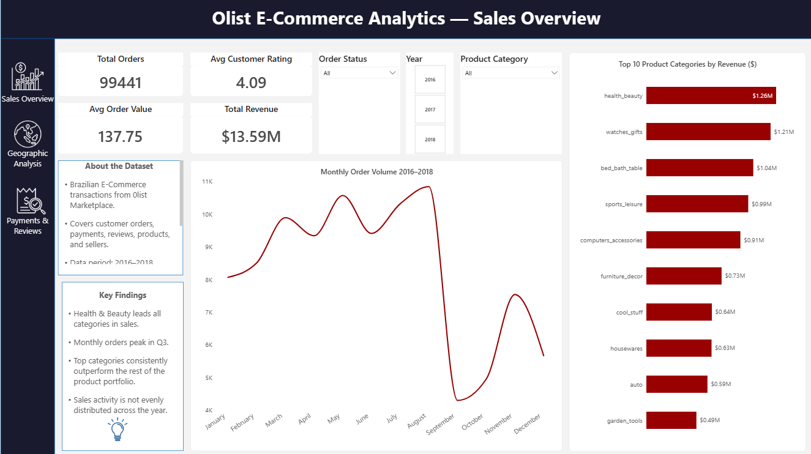
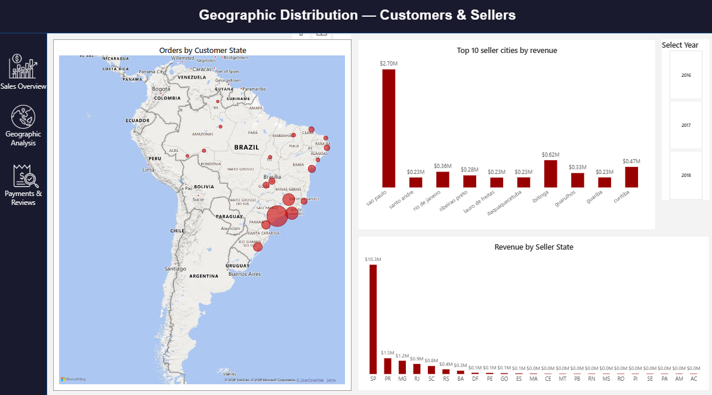
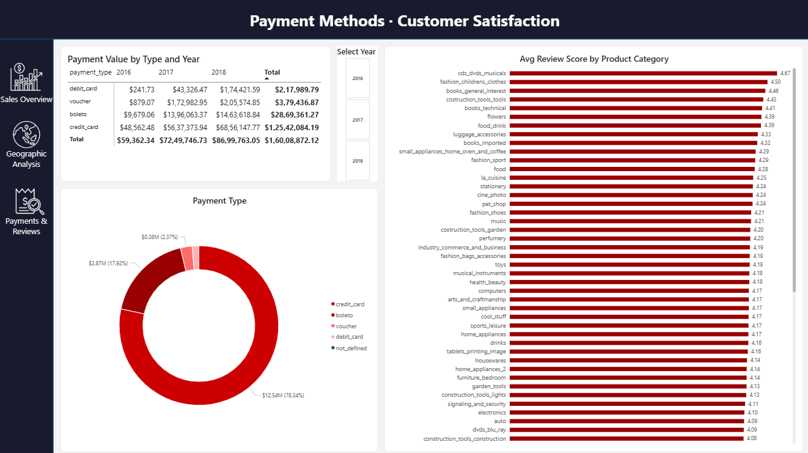
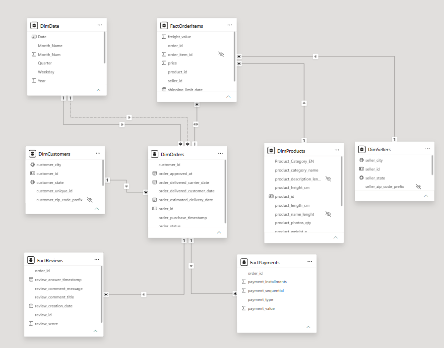

<div align="center">

# 🛒 Olist E-Commerce Analytics Dashboard
### Power BI | Brazilian E-Commerce | 99,441 Orders | 2016–2018

[](https://powerbi.microsoft.com/)
[](https://learn.microsoft.com/en-us/dax/)
[](https://learn.microsoft.com/en-us/power-query/)
[](https://www.kaggle.com/datasets/olistbr/brazilian-ecommerce)

</div>

---

## 📽️ Demo

> 📹 Full walkthrough video → [Watch E-commerce_dashboard.mp4](https://drive.google.com/file/d/1uSBIVaIbYiJ86_VbdcFw7TR6Ynwke9Tg/view?usp=sharing)

---

## 📌 Project Overview

This end-to-end Power BI project analyzes **Olist** — Brazil's largest e-commerce marketplace — using **8 raw CSV datasets** sourced from Kaggle. The goal was to build a recruiter-ready, analyst-grade dashboard covering sales performance, geographic distribution, payment behaviour, and customer satisfaction.

**Key figures at a glance:**

| Metric | Value |
|--------|-------|
| Total Orders | 99,441 |
| Total Revenue | $13.59M |
| Avg Order Value | $137.75 |
| Avg Customer Rating | 4.09 / 5 |
| Date Range | Jan 2016 – Dec 2018 |

---

## 📊 Dashboard Pages

### Page 1 — Sales Overview


> KPI cards, monthly order trend (2016–2018), order distribution map across Brazilian states, and top 10 product categories by revenue. Includes slicers for Order Status, Year, and Product Category.

---

### Page 2 — Geographic Distribution


> Customer order concentration by state on an interactive map, top 10 seller cities by revenue, and revenue breakdown by seller state. SP (São Paulo) dominates both customer demand and seller supply.

---

### Page 3 — Payments & Customer Satisfaction


> Payment type mix (credit card = 78.34%), payment value by type and year matrix, and average review score ranked across all product categories.

---

## 🗂️ Dataset

**Source:** [Olist Brazilian E-Commerce — Kaggle](https://www.kaggle.com/datasets/olistbr/brazilian-ecommerce)

| File | Rows | Description |
|------|------|-------------|
| `olist_orders_dataset.csv` | 99,441 | Order master — status, timestamps |
| `olist_order_items_dataset.csv` | 112,650 | Line items — price, freight, seller |
| `olist_order_payments_dataset.csv` | 103,886 | Payment type, value, installments |
| `olist_order_reviews_dataset.csv` | 104,719 | Review scores and comments |
| `olist_customers_dataset.csv` | 99,441 | Customer city, state, zip |
| `olist_products_dataset.csv` | 32,951 | Product category, dimensions, weight |
| `olist_sellers_dataset.csv` | 3,095 | Seller city and state |
| `product_category_name_translation.csv` | 71 | Portuguese → English category names |

---

## 🔄 Power Query — Applied Steps per Table

### DimProducts
| Step | Detail |
|------|--------|
| Source | Loaded `olist_products_dataset.csv` |
| Promoted Headers | First row set as column headers |
| Changed Type | Set column data types |
| Merged Queries | Merged with `CategoryTranslation` on `product_category_name` |
| Expanded CategoryTranslation | Expanded merged table to bring in `product_category_name_english` |
| Renamed Columns | Renamed `product_category_name_english` → `Product_Category_EN` |

### CategoryTranslation
| Step | Detail |
|------|--------|
| Source | Loaded `product_category_name_translation.csv` |
| Changed Type | Set column data types |
| Promoted Headers | First row set as column headers |
| Changed Type1 | Re-applied types after header promotion |

### DimOrders
| Step | Detail |
|------|--------|
| Source | Loaded `olist_orders_dataset.csv` |
| Promoted Headers | First row set as column headers |
| Changed Type | Set column data types |
| Changed Type1 | Re-applied types for remaining columns |
| Extracted Date | Extracted date portion from timestamp columns |

### DimDate *(built in Power Query, not from CSV)*
| Step | Detail |
|------|--------|
| StartDate / EndDate / Duration / Dates / Table | Generated a date range list and converted to table |
| ChangedType | Set `Date` column type |
| AddYear / AddQuarter / AddMonth / AddMonthName / AddWeekday / AddYearQuarter | Added individual calendar columns |
| Renamed Columns | Standardised column names |
| Removed Columns | Removed auto-generated `Date_hierarchy` column |

### All Other Tables *(FactOrderItems, DimCustomers, DimGeolocation, FactPayments, FactReviews, DimSellers)*
| Step | Detail |
|------|--------|
| Source | Loaded respective CSV file |
| Changed Type | Set column data types |

---

## 🧮 DAX — DimDate Table

`DimDate` was built entirely in DAX (not from a CSV), enabling proper time intelligence across all date fields.

```dax
DimDate = 
ADDCOLUMNS(
    CALENDAR(DATE(2016, 1, 1), DATE(2018, 12, 31)),
    "Year",       YEAR([Date]),
    "Month_Num",  MONTH([Date]),
    "Month_Name", FORMAT([Date], "MMMM"),
    "Quarter",    "Q" & QUARTER([Date]),
    "Weekday",    FORMAT([Date], "DDDD")
)
```

This table connects to `DimOrders[order_purchase_timestamp]` enabling Year/Quarter/Month slicers across all pages.

---

## 🗃️ Data Model (Star Schema)



### Relationships

| From Table | Key | → To Table | Key | Cardinality |
|------------|-----|-----------|-----|-------------|
| `DimOrders` | `order_id` | `FactOrderItems` | `order_id` | 1 : * |
| `DimOrders` | `order_id` | `FactPayments` | `order_id` | 1 : * |
| `DimOrders` | `order_id` | `FactReviews` | `order_id` | 1 : * |
| `DimOrders` | `customer_id` | `DimCustomers` | `customer_id` | * : 1 |
| `FactOrderItems` | `product_id` | `DimProducts` | `product_id` | * : 1 |
| `FactOrderItems` | `seller_id` | `DimSellers` | `seller_id` | * : 1 |
| `DimDate` | `Date` | `DimOrders` | `order_purchase_timestamp` | 1 : * |

**Schema type:** Star Schema with 3 fact tables (`FactOrderItems`, `FactPayments`, `FactReviews`) and 4 dimension tables (`DimOrders`, `DimCustomers`, `DimProducts`, `DimSellers`, `DimDate`).


---

## 🗺️ Key Insights

- **São Paulo dominates:** SP accounts for ~42% of all orders and ~$10.3M of seller revenue — significant geographic concentration risk.
- **Credit card is king:** 78.34% of total payment value flows through credit cards; boleto (cash voucher) is second at 17.92%.
- **Peak demand:** Order volume peaks in **November–December** (Black Friday / holiday season), with July showing a sharp mid-year dip.
- **Top category:** `health_beauty` leads revenue at $1.26M, outpacing `watches_gifts` ($1.21M) and `bed_bath_table` ($1.04M).
- **Niche categories score highest:** `cds_dvds_musicals` (4.67) and `fashion_roupa_infanto_juvenil` (4.50) have the highest avg review scores despite lower sales volume.

---

## 🛠️ Tools & Skills Used

| Tool | Usage |
|------|-------|
| **Power BI Desktop** | Report authoring, visuals, slicers |
| **Power Query (M)** | ETL — data cleaning, merges, type casting |
| **DAX** | Calculated table (DimDate), KPI measures |
| **Bing Maps visual** | Geographic order and revenue distribution |
| **Matrix visual** | Payment value by type × year cross-tab |

---

## 📁 Repository Structure

```
E-commerce_Sales_Dashboard_Power_BI/
│
├── E-commerce_dataset.pbix          # Power BI report file
│
├── data/                            # Raw source CSVs
│   ├── olist_orders_dataset.csv
│   ├── olist_order_items_dataset.csv
│   ├── olist_order_payments_dataset.csv
│   ├── olist_order_reviews_dataset.csv
│   ├── olist_customers_dataset.csv
│   ├── olist_products_dataset.csv
│   ├── olist_sellers_dataset.csv
│   └── product_category_name_translation.csv
│
├── screenshots/
│   ├── Page1.png                    # Sales Overview
│   ├── Page2.png                    # Geographic Analysis
│   ├── Page3.png                    # Payments & Reviews
│   └── ModelView.png                # Data model diagram
│
└── README.md
```

---

## 🚀 How to Run

1. Clone this repository
2. Place all CSV files from `/data` in the same folder
3. Open `E-commerce_dataset.pbix` in **Power BI Desktop** (free)
4. If prompted, update the data source path to your local `/data` folder
5. Click **Refresh** — all 8 tables load automatically

> **Requirement:** Power BI Desktop (free) — [Download here](https://powerbi.microsoft.com/desktop/)

---

## 👤 Author

**Harshal Vora**
B.E. Computer Engineering | Data Analytics Enthusiast

[](https://github.com/HarshalVara86)

---

<div align="center">

*If this project was useful, consider giving it a ⭐*

</div>
